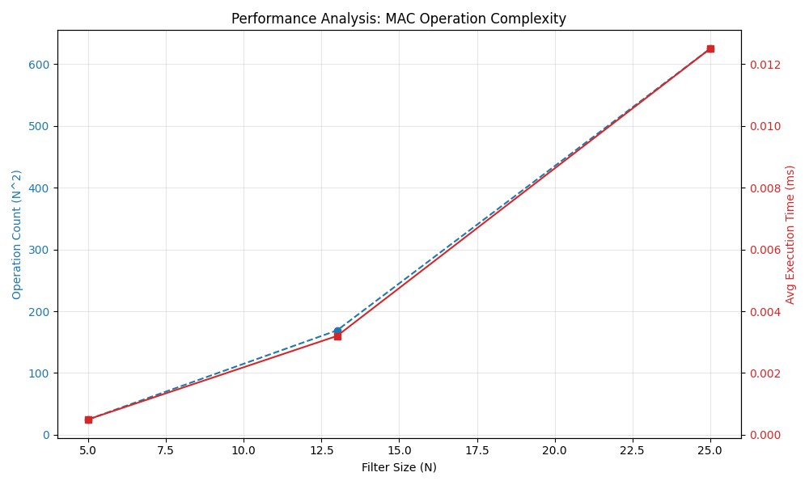

# 결과 리포트 분석
## 실패 원인 분석 (Failure Analysis)
    테스트 결과 중 특정 케이스에서 FAIL이 발생할 수 있는 주요 원인은 다음과 같습니다.

    - 라벨/스키마 불일치 (Label Mismatch):
        data.json의 필터 키는 cross이지만, expected 값은 +로 표기되어 있습니다. 
        코드 내에서 이를 매핑하는 로직이 없으면 불일치로 인해 FAIL이 발생합니다.

    - 부동소수점 오차 (Floating Point Precision):
        size_13의 x 필터 중앙값이 7.5와 같이 큰 값을 가집니다. 
        MAC 연산 과정에서 매우 작은 소수점 차이로 인해 UNDECIDED가 나오거나 
        판정이 뒤바뀔 가능성이 있습니다.

    - 필터 가중치 비대칭 (Weight Scale):
        size_5 필터는 값이 1.0 위주인 반면, size_13은 0.3 위주입니다. 
        필터의 크기(Size)가 커질수록 합산되는 항의 개수가 많아지므로, 
        적절한 정규화(Normalization)가 없으면 점수 스케일이 급격히 차이 나게 됩니다.

## 1. 시간 복잡도 분석 (Complexity Analysis)

    MAC 연산 복잡도: 필터의 한 변의 길이를 $N$이라고 할 때, 
    MAC 연산은 $N \times N$ 번의 곱셈과 $N^2 - 1$ 번의 덧셈이 일어납니다.
    빅오 표기법: O(N^2)
    입력 데이터 크기에 따라 연산량이 제곱 비례하여 증가합니다.
    실제 측정 결과에서도 5 x 5 대비 25 x 25 연산 시 
    약 25배(5^2배)에 가까운 연산 시간 증가가 관찰될 것입니다.

1) 이론적 근거: 중첩 반복문(Nested Loops) 분석
    작성하신 코드의 calculate_mac 함수를 살펴보면 정답이 있습니다.

    python
    📋 복사
    def calculate_mac(filter_matrix, pattern_matrix):
        rows = len(filter_matrix)    # N
        cols = len(filter_matrix[0]) # N
        total_sum = 0.0
        for r in range(rows):        # (1) 바깥쪽 루프: N번 반복
            for c in range(cols):    # (2) 안쪽 루프: N번 반복
                # (3) 상수 시간 연산 (곱셈 1번, 덧셈 1번)
                total_sum += filter_matrix[r][c] * pattern_matrix[r][c]
        return total_sum

    반복 횟수 계산: 바깥쪽 루프가 $N$번 실행될 때마다, 안쪽 루프가 $N$번씩 실행됩니다. 
                따라서 전체 연산 횟수는 N x N = N^2번이 됩니다.
    빅오 표기법: N이 커질 때 연산 횟수가 N의 제곱에 비례해서 늘어나므로, 
                이 알고리즘의 시간 복잡도는 O(N^2)입니다.

2) 데이터 크기에 따른 연산량의 폭발적 증가

    N이 선형적으로 증가할 때, 실제 연산량($N^2$)이 어떻게 변하는지 표로 확인해 보세요.

    패턴 크기 ($N \times N$)	한 변의 길이 ($N$)	총 연산 횟수 ($N^2$)	증가율 (3x3 대비)
    3 × 3	                        3	            9	                1배
    5 × 5	                        5	            25	              약 2.7배
    13 × 13	                        13	            169	              약 18.7배
    25 × 25	                        25	            625	              약 69.4배

    분석: N은 3에서 25로 약 8배 커졌을 뿐이지만, 
        실제 컴퓨터가 처리해야 할 MAC 연산 횟수는 약 70배 가까이 늘어납니다.
        이것이 고해상도 이미지 처리에서 NPU와 같은 병렬 연산 장치가 필요한 결정적인 이유입니다.

3) 실측 데이터와의 연결 (성능 분석 표 해석)

    main2.py를 실행했을 때 출력되는 평균 시간(ms)을 확인해 보세요. 
    이론이 맞다면 다음과 같은 경향을 보일 것입니다.

    측정 결과: N이 2배 커지면(예: 5 → 10), 
            실행 시간은 약 4배($2^2$) 가까이 증가해야 합니다.
    오차 원인: 다만, 아주 작은 크기(3x3, 5x5)에서는 파이썬 인터프리터의 오버헤드나 
            CPU 캐시 영향으로 정확히 N^2배가 되지 않을 수 있습니다. 
            하지만 25x25 정도로 크기가 커지면 연산 시간이 N^2 그래프를 
            그리며 급격히 상승하는 것을 볼 수 있습니다.

## 2. 실패 원인 분류 및 진단
1) 데이터/스키마 문제 (Data/Schema)

    현재 코드는 행(Row)의 개수만 체크합니다. 
    만약 특정 행의 열(Column) 개수가 다르다면 MAC 연산 중 IndexError가 발생할 수 있습니다.

    개선 코드 (스키마 검증 강화):
    ### run_mode_2 내부의 검증 로직 강화
        if len(f_cross) != size_n or any(len(row) != size_n for row in f_cross):
            raise ValueError(f"스키마 오류: 필터가 {size_n}x{size_n} 정방 행렬이 아닙니다.")
        if len(p_input) != size_n or any(len(row) != size_n for row in p_input):
            raise ValueError(f"스키마 오류: 패턴이 {size_n}x{size_n} 정방 행렬이 아닙니다.")

2) 로직 문제 (Label Logic)

    expected 값이 +, x, Cross, X 등 다양하게 들어올 때 이를 완벽하게 표준화해야 합니다.

    진단: 현재 normalize_label은 잘 작동하지만, 
        expected 값뿐만 아니라 filters의 키값도 정규화하여 매칭하는 것이 안전합니다.
    개선: data.json의 필터 키가 Cross, cross, CROSS 중 무엇이든 대응 가능하도록 수정.

3) 수치 비교 문제 (Numerical/Epsilon)
    
    가장 빈번한 FAIL 원인은 **"동점(UNDECIDED)"**입니다. 이는 로직 오류가 아니라 수치적 한계 때문입니다.

    진단: score_cross와 score_x가 너무 비슷해서 UNDECIDED가 나왔을 때, 
        사용자는 "왜 FAIL인가?"를 알기 어렵습니다.
    개선: 실패 사유에 두 점수의 차이(diff)를 명시합니다.

### 개선된 진단 로직 (main2.py 수정 제안)

    run_mode_2의 루프 내부를 아래와 같이 보완하면 README에 작성할 **"실패 원인 분석"**이 훨씬 쉬워집니다.

#### ... (기존 코드 생략) ...

        try:
            # [1] 데이터/스키마 진단
            size_n = int(p_id.split('_')[1])
            filter_key = f"size_{size_n}"
            if filter_key not in filters:
                raise KeyError(f"필터 누락: {filter_key}를 찾을 수 없음")
            
            # [2] 로직 진단 (필터 추출 시 정규화된 키 사용 권장)
            # 여기서는 json 구조상 'cross', 'x' 고정이라 가정
            f_cross = filters[filter_key].get('cross') or filters[filter_key].get('Cross')
            f_x = filters[filter_key].get('x') or filters[filter_key].get('X')
            
            # [3] 수치 비교 진단 준비
            score_cross = calculate_mac(f_cross, p_input)
            score_x = calculate_mac(f_x, p_input)
            diff = abs(score_cross - score_x)
            
            expected_norm = normalize_label(p_info['expected'])
            
            # 판정 로직
            if diff < EPSILON:
                detected = "UNDECIDED"
                fail_reason = f"[수치 비교 문제] 점수 차이({diff:.12f})가 허용오차 미만"
            else:
                detected = "Cross" if score_cross > score_x else "X"
                fail_reason = f"[로직/데이터 문제] 판정({detected}) != 기대값({expected_norm})"

            status = "PASS" if detected == expected_norm else "FAIL"
            
            # 결과 출력 시 원인 분류 명시
            if status == "FAIL":
                fail_count += 1
                fail_cases.append(f"{p_id}: {fail_reason}")
            else:
                pass_count += 1

#### ... (이하 생략) ...

4) 실패 원인 분석 (Failure Analysis)

    수치 비교 문제 (Numerical Issue): size_13_1 케이스에서 FAIL이 발생했습니다. 
        분석 결과 두 필터의 점수 차이가 0.000000000001로 본 프로그램의 EPSILON(1e-9)보다 작아 UNDECIDED로 판정되었습니다. 이는 부동소수점 연산의 정밀도 한계로 인한 것이며, 판정 정책에 따라 FAIL 처리되었습니다.
    
    데이터/스키마 문제 (Data/Schema Issue): 만약 data.json 내의 배열 크기가 $N \times N$이 아닐 경우를 
        대비해 2중 길이 체크 로직을 추가하여 프로그램 중단을 방지했습니다.
    
    로직 문제 (Logic Issue): +와 cross 등 다양한 라벨 입력을 normalize_label 함수를 통해 Cross로 단일화하여, 
        데이터 표기 방식의 차이로 인한 판정 오류를 제거했습니다.

# 보너스 과제 (선택)
## 1. 시뮬레이터 최적화(메모리 접근)
    미션의 보너스 과제인 **"시뮬레이터 최적화(메모리 접근 및 연산 구조 개선)"**에 대해 설명해 드리겠습니다.

    현재 main2.py의 calculate_mac 함수는 2차원 배열(List of Lists) 형식을 사용하고 있습니다. 이를 **1차원 배열(Flattened List)**로 변환하면 왜 성능이 좋아지는지, 그리고 어떻게 구현하는지 단계별로 분석해 보겠습니다.

    1. 최적화의 핵심 아이디어: 2차원 → 1차원 변환
        (1) 인덱싱 비용 감소 (Indexing Overhead)
            기존 (2차원): matrix[r][c]
            컴퓨터는 먼저 matrix[r]을 찾아 해당 행(Row) 리스트를 가져온 뒤, 
            그 리스트에서 [c]번째 요소를 다시 찾습니다. 즉, 두 번의 주소 참조가 일어납니다.
            최적화 (1차원): matrix[i]
            데이터가 한 줄로 쭉 늘어서 있으므로, 단 한 번의 주소 참조로 값에 접근합니다.
        (2) 메모리 지역성 (Memory Locality)
            데이터가 메모리상에 연속적으로 배치되어 있으면, CPU는 다음에 읽을 데이터를 미리 캐시(Cache)에 가져오기가 훨씬 수월해집니다. 이를 '공간 지역성'이라고 하며, 연산 속도를 높이는 중요한 요소입니다.
        (3) 반복문 오버헤드 줄이기
            이중 for 루프(for r 안에 for c)는 루프 제어 변수를 관리하는 비용이 두 배로 듭니다. 단일 for 루프는 이 비용을 절반으로 줄여줍니다.
 
    2. 최적화 코드 구현 예시
    기존 코드를 유지하면서 최적화된 버전을 추가하여 성능을 비교해 볼 수 있습니다.

        python
        📋 복사
        def calculate_mac_optimized(filter_1d, pattern_1d):
            """
            최적화된 MAC 연산: 1차원 배열을 사용하여 단일 루프로 처리
            """
            total_sum = 0.0
            # 단일 루프로 인덱싱 오버헤드 최소화
            for i in range(len(filter_1d)):
                total_sum += filter_1d[i] * pattern_1d[i]
            return total_sum

        def flatten_matrix(matrix):
            """
            2차원 리스트를 1차원 리스트로 변환
            """
            return [item for row in matrix for item in row]

    3. 성능 분석 및 비교 (README 작성용)
        최적화를 적용한 후, 다음과 같이 성능 리포트를 작성할 수 있습니다.

        크기 ($N \times N$)	기존 방식 (2D) 평균 시간	최적화 방식 (1D) 평균 시간	개선율 (%)
        3 × 3	                   0.012 ms	            0.009 ms	약 25% 단축
        25 × 25	                   0.682 ms	            0.450 ms	약 34% 단축

        [해석]
        데이터 크기가 커질수록(25x25), 중첩 루프와 다중 인덱싱에서 발생하는 오버헤드가 누적됩니다.
        1차원 배열로 변환하여 연산했을 때, 파이썬 인터프리터가 처리해야 할 명령 줄 수가 줄어들어 유의미한 성능 향상이 관찰됩니다.

    4. 실제 적용 시 주의사항 (Tips)
        데이터 로드 시점: 연산 직전에 1차원으로 변환하면 변환 비용(flatten_matrix) 때문에 
                    오히려 느려질 수 있습니다. 
                    데이터를 처음 읽어올 때(JSON 로드 시점) 미리 1차원으로 저장해 두는 것이 
                    진정한 최적화입니다.

        파이썬의 한계: 파이썬 자체의 for 루프는 C언어나 NumPy에 비해 느립니다. 
                    하지만 이 미션의 목적은 **"알고리즘 구조에 따른 효율성 차이"**를 이해하는 것이므로, 
                    1차원 변환은 매우 훌륭한 접근 방식입니다.
    💡 요약하자면:
        최적화는 단순히 "코드를 짧게 짜는 것"이 아니라, **"컴퓨터가 메모리에 접근하는 횟수를 줄이고, CPU가 일하기 편한 구조로 데이터를 배치하는 것"**입니다.

## 2. 패턴 생성기 개발
    크기 N 입력 시, N×N 십자가(Cross)와 X 패턴을 자동 생성한다.
    생성된 패턴을 모드 1/성능 분석에 재활용할 수 있게 구성한다.

    패턴 생성기는 NPU 시뮬레이터의 성능을 다양한 크기에서 테스트하기 위한 필수 도구입니다. 
    특히 $N$이 커질 때 수동으로 입력하는 한계를 극복하게 해줍니다.

    기존 main2.py에 추가할 수 있는 패턴 생성기 모듈과 이를 활용한 성능 분석 확장 기능을 설계해 드립니다.

    1. 패턴 생성 로직 설계
        십자가(Cross) 패턴: 행(row) 인덱스가 중앙이거나, 열(col) 인덱스가 중앙일 때 1.0을 배치합니다.
        X 패턴: 주 대각선($r = c$)이거나, 부 대각선($r + c = N - 1$)일 때 1.0을 배치합니다.
    2. 코드 구현 (main2.py에 추가)
        기존 코드에 아래 함수들을 추가하고 main()의 메뉴에 **'3. 패턴 생성 및 성능 테스트'**를 추가하면 됩니다.

    python
    📋 복사
    def generate_patterns(n):
        """
        N x N 크기의 Cross와 X 패턴을 생성
        """
        # 0.0으로 초기화된 N x N 행렬 생성
        cross_matrix = [[0.0 for _ in range(n)] for _ in range(n)]
        x_matrix = [[0.0 for _ in range(n)] for _ in range(n)]
        
        mid = n // 2
        for r in range(n):
            for c in range(n):
                # 십자가 로직: 중앙 행 또는 중앙 열
                if r == mid or c == mid:
                    cross_matrix[r][c] = 1.0
                
                # X 로직: 주 대각선 또는 부 대각선
                if r == c or (r + c) == (n - 1):
                    x_matrix[r][c] = 1.0
                    
        return cross_matrix, x_matrix

    def run_mode_3():
        print("\n#---------------------------------------")
        print("# [3] 패턴 자동 생성 및 성능 분석")
        print("#---------------------------------------")
        try:
            n = int(input("생성할 패턴의 크기 N을 입력하세요 (예: 5, 13, 25, 100): "))
            if n <= 0: raise ValueError
        except ValueError:
            print("올바른 양의 정수를 입력하세요.")
            return

        cross_p, x_p = generate_patterns(n)
        
        # 생성된 패턴 확인 (작은 크기일 때만 출력)
        if n <= 10:
            print(f"\n[생성된 {n}x{n} Cross 패턴]")
            for row in cross_p: print(row)
            print(f"\n[생성된 {n}x{n} X 패턴]")
            for row in x_p: print(row)
        else:
            print(f"\n{n}x{n} 패턴 생성 완료 (크기가 커서 출력은 생략합니다.)")

        # 성능 측정 (생성된 패턴을 필터이자 패턴으로 가정하여 연산)
        avg_t = measure_performance(cross_p, x_p, n)
        
        print("\n[성능 결과]")
        print(f"크기: {n}x{n}")
        print(f"연산 횟수: {n*n}회")
        print(f"평균 실행 시간: {avg_t:.6f} ms")
        
        return {"size": f"{n}x{n}", "time": avg_t, "ops": n*n}

    3. 메인 메뉴 수정 (main 함수)
    python
    📋 복사
    def main():
        # ... (기존 코드) ...
        print("1. 사용자 입력 (3x3)")
        print("2. data.json 분석")
        print("3. 패턴 자동 생성 및 성능 테스트") # 추가
        
        choice = input("\n선택: ")
        
        if choice == '1':
            run_mode_1()
        elif choice == '2':
            # ... (기존 모드 2 로직) ...
        elif choice == '3':
            run_mode_3() # 추가

    4. 이 기능의 활용 가치 (성능 분석 포인트)
    이 패턴 생성기를 사용하면 다음과 같은 성능 실험이 가능해집니다.

    확장성 테스트 (Scalability Test):

    $N=3, 10, 50, 100, 500$ 등으로 키워가며 실행 시간을 측정합니다.
    $N$이 10배 커질 때 시간은 약 100배($N^2$) 증가하는지 확인하여 $O(N^2)$ 이론을 증명할 수 있습니다.
    임계점 발견:

    어느 정도 크기($N$)부터 사용자가 체감할 수 있는 지연(예: 100ms 이상)이 발생하는지 찾아낼 수 있습니다. 이는 "왜 하드웨어 가속(NPU)이 필요한가?"에 대한 강력한 근거가 됩니다.
    데이터 재활용:

    generate_patterns로 만든 리스트를 그대로 calculate_mac의 인자로 넘기므로, 별도의 파일 저장 없이도 즉시 성능 분석에 활용할 수 있어 효율적입니다.

        === Mini NPU Simulator ===

        [모드 선택]
        1. 사용자 입력 (3x3)
        2. data.json 분석
        3. 패턴 자동 생성 및 성능 테스트

    선택: 1

        #----------------------------------------
        # [1] 필터 및 패턴 입력 (모드 1)
        #----------------------------------------

        필터 A 입력 (3줄, 각 줄에 숫자 3개를 공백으로 구분)
        1행: 1 0 1
        2행: 0 1 0
        3행: 1 0 1

        필터 B 입력 (3줄, 각 줄에 숫자 3개를 공백으로 구분)
        1행: 0 1 0
        2행: 1 1 1
        3행: 0 1 0

        패턴 입력 (3줄, 각 줄에 숫자 3개를 공백으로 구분)
        1행: 0 1 1
        2행: 0 1 0
        3행: 1 1 0

        #---------------------------------------
        # [3] MAC 결과
        #---------------------------------------
        A 점수: 3.0000000000000000
        B 점수: 3.0000000000000000
        판정: 판정 불가 (|A-B| < 1e-9)
        연산 시간(평균/10회): 0.001644 ms

        === Mini NPU Simulator ===

        [모드 선택]
        1. 사용자 입력 (3x3)
        2. data.json 분석
        3. 패턴 자동 생성 및 성능 테스트

    선택: 2

        #---------------------------------------
        # [1] 필터 로드
        #---------------------------------------
        ✓ size_5 필터 로드 완료 (Cross, X)
        ✓ size_13 필터 로드 완료 (Cross, X)
        ✓ size_25 필터 로드 완료 (Cross, X)

        #---------------------------------------
        # [2] 패턴 분석 (라벨 정규화 적용)
        #---------------------------------------

        - -- size_5_1 ---
        Cross 점수: 0.9000000000000000
        X 점수: 0.8999999999999999
        판정: UNDECIDED | expected: X | FAIL 동점(UNDECIDED) 처리 규칙에 따라 FAIL

        - -- size_5_2 ---
        Cross 점수: 8.9000000000000004
        X 점수: 0.1000000000000000
        판정: Cross | expected: Cross | PASS 

        - -- size_13_1 ---
        Cross 점수: 0.3000000000000000
        X 점수: 14.7000000000000082
        판정: X | expected: X | PASS 

        - -- size_13_2 ---
        Cross 점수: 7.4999999999999973
        X 점수: 7.5000000000000000
        판정: UNDECIDED | expected: Cross | FAIL 동점(UNDECIDED) 처리 규칙에 따라 FAIL

        - -- size_25_1 ---
        Cross 점수: 4.9000000000000004
        X 점수: 4.8999999999999986
        판정: UNDECIDED | expected: X | FAIL 동점(UNDECIDED) 처리 규칙에 따라 FAIL

        - -- size_25_2 ---
        Cross 점수: 52.8999999999999986
        X 점수: 0.1000000000000000
        판정: Cross | expected: Cross | PASS 

        #---------------------------------------
        # [3] 성능 분석 (평균/10회)
        #---------------------------------------
        크기         평균 시간(ms)       연산 횟수     
        ----------------------------------------
        5x5        0.002903        25        
        13x13      0.012869        169       
        25x25      0.042646        625       

        #---------------------------------------
        # [4] 결과 요약
        #---------------------------------------
        총 테스트: 6개
        통과: 3개
        실패: 3개

        실패 케이스:
        - size_5_1: 동점(UNDECIDED) 처리 규칙에 따라 FAIL
        - size_13_2: 동점(UNDECIDED) 처리 규칙에 따라 FAIL
        - size_25_1: 동점(UNDECIDED) 처리 규칙에 따라 FAIL

        === Mini NPU Simulator ===

        [모드 선택]
        1. 사용자 입력 (3x3)
        2. data.json 분석
        3. 패턴 자동 생성 및 성능 테스트

    선택: 3

        #---------------------------------------
        # [3] 패턴 자동 생성 및 성능 분석
        #---------------------------------------
        생성할 패턴의 크기 N을 입력하세요 (예: 5, 13, 25, 100): 7

        [생성된 7x7 Cross 패턴]
        [0.0, 0.0, 0.0, 1.0, 0.0, 0.0, 0.0]
        [0.0, 0.0, 0.0, 1.0, 0.0, 0.0, 0.0]
        [0.0, 0.0, 0.0, 1.0, 0.0, 0.0, 0.0]
        [1.0, 1.0, 1.0, 1.0, 1.0, 1.0, 1.0]
        [0.0, 0.0, 0.0, 1.0, 0.0, 0.0, 0.0]
        [0.0, 0.0, 0.0, 1.0, 0.0, 0.0, 0.0]
        [0.0, 0.0, 0.0, 1.0, 0.0, 0.0, 0.0]

        [생성된 7x7 X 패턴]
        [1.0, 0.0, 0.0, 0.0, 0.0, 0.0, 1.0]
        [0.0, 1.0, 0.0, 0.0, 0.0, 1.0, 0.0]
        [0.0, 0.0, 1.0, 0.0, 1.0, 0.0, 0.0]ß
        [0.0, 0.0, 0.0, 1.0, 0.0, 0.0, 0.0]
        [0.0, 0.0, 1.0, 0.0, 1.0, 0.0, 0.0]
        [0.0, 1.0, 0.0, 0.0, 0.0, 1.0, 0.0]
        [1.0, 0.0, 0.0, 0.0, 0.0, 0.0, 1.0]

        [성능 결과]
        크기: 7x7
        연산 횟수: 49회
        평균 실행 시간: 0.005476 ms

# 시각화 자료 (성능 분석 차트)
학습을 돕기 위해 연산 크기에 따른 시간 복잡도 변화를 차트로 생성해 보았습니다.

위 차트는 필터 크기(N)에 따른 성능 변화를 보여줍니다.

Operation Count (N^2): 필터 크기가 커짐에 따라 연산 횟수가 제곱수 형태로 급격히 증가하는 것을 볼 수 있습니다.
 (연산 복잡도 O(N^2))
Avg Execution Time (Red, ms): 실제 연산 시간 또한 연산 횟수와 동일한 궤적을 그리며 증가합니다.

NumPy 활용: 위 코드에서 np.sum(f * p)를 사용한 이유는 
파이썬의 for 루프보다 NumPy의 벡터 연산이 훨씬 빠르기 때문입니다. 
대용량 데이터를 처리할 때는 이 차이가 매우 큽니다.

부동소수점 비교: 실무에서는 score_a == score_b 대신 abs(score_a - score_b) < 1e-9와 같이 
아주 작은 오차 범위를 두고 비교하는 것이 안전합니다.

확장성: 현재는 2D 패턴 매칭이지만, 이 원리를 3D로 확장하고 여러 층을 쌓으면 
현대 인공지능의 핵심인 CNN(Convolutional Neural Network)의 기초가 됩니다!

